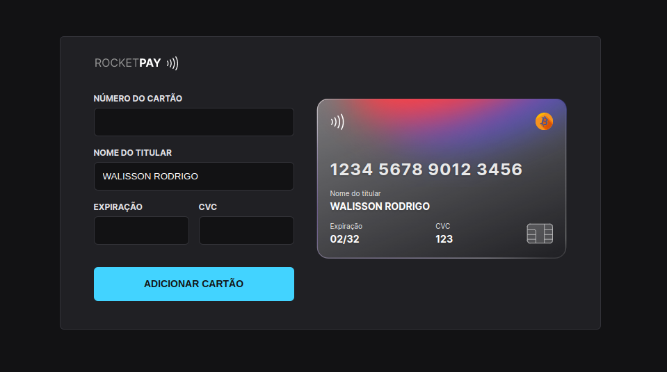

<h1 align="center"> Explorer Lab #01 </h1>

<p align="center">
Exclusive and free event, promoted by Rocketseat for teaching WEB technologies.
</p>

<p align="center">
  <a href="#-technologies">Technologies</a>&nbsp;&nbsp;&nbsp;|&nbsp;&nbsp;&nbsp;
  <a href="#-project">Project</a>&nbsp;&nbsp;&nbsp;|&nbsp;&nbsp;&nbsp;
  <a href="#-layout">Layout</a>&nbsp;&nbsp;&nbsp;|&nbsp;&nbsp;&nbsp;
  <a href="#memo-license">License</a>
</p>

<p align="center">
  
</p>

<br>

<p align="center">
  
</p>

## 🚀 Technologies

This project was developed with the following technologies:

- HTML e CSS
- JavaScript e JSON
- [Node e NPM](https://nodejs.org/)
- [Vite](https://vitejs.dev/)
- [iMask](https://imask.js.org)

## 💻 Project

Rocketpay is a component that simulates the credit card filling form, where it is possible to add mask to the inputs and update HTML elements via DOM.

How to improve it was included the ELO flag with validation for the beginning of these cards that can be tested using the following initial sequences:
`636368 | 438935 | 504175 | 451416 | 636297 | 5067 | 4576 | 4011`

Also contains bitcoin as a choice but without validation so it can only be tested via browser using browser console. To do this, open the browser's DevTools (F12) and type the following command:

```bash
  setCardType("bitcoin")
```

## 🔖 Layout

You can view the project layout through [THIS LINK](<https://www.figma.com/file/fxNbQpyo6xqgyYX3UKyBGO/Explorer-Lab-%2301-(Copy)?node-id=3%3A2594>). You need an account on [Figma](https://figma.com) to access it.

## :memo: License

This project is under the MIT license.

---

Fork made with ♥ by Rocketseat :wave: [Join our community!](https://discord.gg/rocketseat)

Translated Readme by [Walisson Rodrigo](https://linkedin.com/in/walissonrodrigo)
